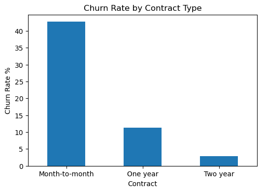
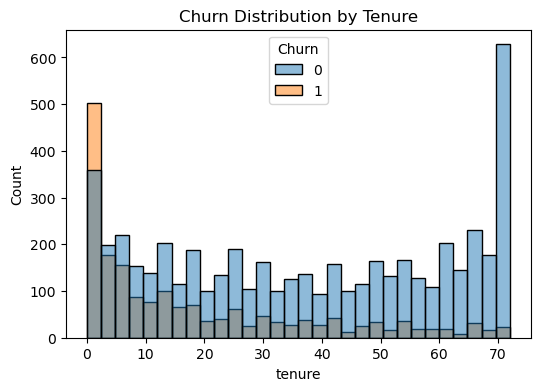
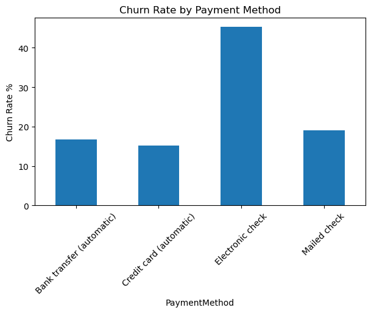

# Customer Retention & Churn Analysis

## Project Overview
This project analyzes customer churn behavior in a telecom subscription business to understand why customers leave and how retention can be improved.

## Tools Used
Python, Pandas, Matplotlib, Seaborn

## Dataset
Telco Customer Churn Dataset containing customer demographic, subscription, and payment details.

## Analysis Performed
- Data exploration and preprocessing
- Overall churn rate calculation
- Contract-based churn analysis
- Tenure-based retention analysis
- Payment method comparison

## Key Insights
- Customers with month-to-month contracts have the highest churn rate
- New customers are more likely to leave than long-term customers
- Electronic check payment users churn more frequently

## Business Recommendations
- Encourage long-term contracts through incentives
- Improve onboarding experience for new customers
- Promote automatic payment methods to reduce churn

## Visualizations

### Contract Churn

### Tenure Churn

### Payment Method Churn

## Conclusion
The analysis identifies key factors affecting customer retention and provides actionable strategies to reduce churn and improve customer lifetime value.
